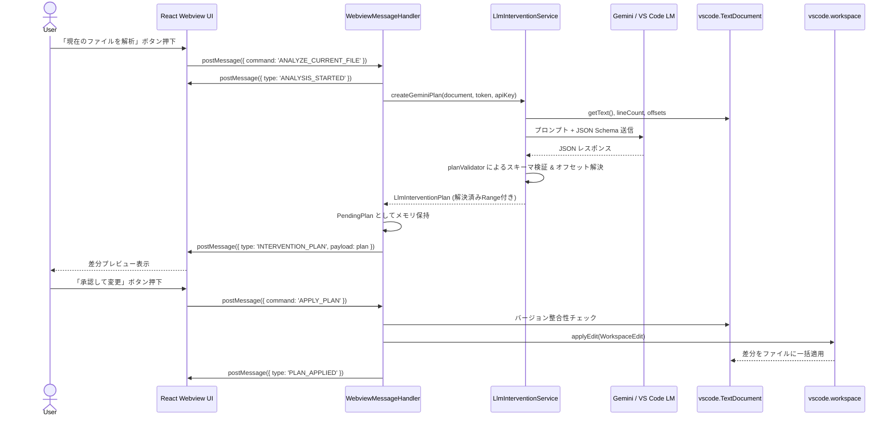

# vibeCodeEase システム仕様書 & アーキテクチャ設計書

本ドキュメントは、VS Code拡張機能 **vibeCodeEase** の全体設計、モジュール責務、データフロー、セキュリティ仕様、およびテスト戦略をまとめた仕様書です。

---

## 1. プロジェクト概要

- **名称**: `vibeCodeEase`
- **目的**: 開発者の作業ストレス（Pain）傾向や学習ニーズに合わせ、タイポ修正や構文エラーなどの介入レベル（サイレント自動修正・サジェスト提案・自力解決スキップ）を動的に最適化する、AIアシスタント・学習支援拡張機能。
- **主要機能**:
  - **プリセットモード**: 🎓 学習モード (Learning), ⚡ フローモード (Flow), 🛠️ 職人モード (Zen), ⚙️ カスタム調整 (Custom)
  - **介入判定エンジン**: ユーザーの嗜好値（0.0〜1.0）に基づき、エディタUIの介入レベルを動的に制御
  - **言語不問のリアルタイム検知**: VS Code Diagnostics（言語サーバーの赤波線）をフックし、全言語のエラーを分類
  - **保存時サイレント修正**: `onWillSaveTextDocument` によるタイポ等の安全な自動修正
  - **行動ログ & 適応型提案**: ユーザーの受容パターンを分析し、最適なモード変更をプロアクティブに提案
- **技術スタック**:
  - **Extension Host**: TypeScript, VS Code API (`vscode.lm`, `vscode.languages`, `SecretStorage`, `WebviewView`)
  - **フロントエンド UI**: React 19, Vite, TypeScript, Vanilla CSS (VS Code Native Theme variables)
  - **LLM連携**: Google Generative Language API (Gemini REST API), VS Code Language Model API
  - **テスト環境**: Mocha, `@vscode/test-cli`, `@vscode/test-electron`

---

## 2. 全体アーキテクチャ

```mermaid
graph TB
    subgraph VS Code Editor Native
        DOC[Active TextDocument]
        EDIT[WorkspaceEdit / TextEdit]
        HOVER_UI[Hover Tooltip]
        QUICKFIX_UI[QuickFix Menu]
        STATUS_UI[Status Bar]
        DIAG[VS Code Diagnostics]
    end

    subgraph vibeCodeEase Extension Host
        EXT[extension.ts]
        
        subgraph Core Analyzers & Engine
            IE[InterventionEngine]
            CA[CodeAnalyzer]
            DS[DiagnosticsService]
            SFS[SilentFixService]
            HP[VibeHoverProvider]
            CAP[VibeCodeActionProvider]
        end

        subgraph Research & Adaptive
            ALS[ActionLogService]
            AE[AdaptiveEngine]
        end

        subgraph LLM Integration Subsystem
            LIS[LlmInterventionService]
            PB[PromptBuilder]
            PV[PlanValidator]
            GC[GeminiClient]
            VLC[VscodeLmClient]
        end

        subgraph Webview & UI Control
            SP[SidebarProvider]
            WMH[WebviewMessageHandler]
            SB[VibeStatusBar]
        end

        subgraph State & Storage
            GS[GlobalState]
            SEC[SecretStorage]
            CSV[(research_action_log.csv)]
        end
    end

    subgraph Webview UI (React)
        REACT_APP[React App / Presets & Sliders]
    end

    subgraph External LLM APIs
        GEMINI[Gemini REST API]
        VSCODE_LM[VS Code Language Models]
    end

    %% Wiring
    EXT --> SP
    EXT --> HP
    EXT --> CAP
    EXT --> SB
    EXT --> GS
    EXT --> DS
    EXT --> SFS
    EXT --> ALS
    EXT --> AE

    SP --> WMH
    WMH <--> REACT_APP
    WMH --> LIS
    WMH --> SEC
    WMH --> EDIT
    EDIT --> DOC

    HP --> CA
    HP --> IE
    CAP --> CA
    CAP --> IE
    HP --> HOVER_UI
    CAP --> QUICKFIX_UI

    DS --> DIAG
    SFS --> DOC
    SFS --> EDIT

    WMH --> ALS
    WMH --> AE
    ALS --> CSV

    LIS --> PB
    LIS --> PV
    LIS --> GC
    LIS --> VLC
    GC <--> GEMINI
    VLC <--> VSCODE_LM
```

---

## 3. モジュール一覧と責務

| ディレクトリ / ファイル | 責務 |
| :--- | :--- |
| **`src/extension.ts`** | 拡張機能のエントリポイント。Provider、コマンド、ステータスバーの登録とライフサイクル管理。 |
| **`src/core/analyzer.ts`** | ルールベースのコード解析器（`functon`, `if condtion:` などの静的構文チェック）。 |
| **`src/core/HoverProvider.ts`** | カーソル位置の問題箇所に対してホバー解説メッセージを提供。 |
| **`src/core/CodeActionProvider.ts`** | エラー箇所に対してワンクリックで修正できる QuickFix アクションを提供。 |
| **`src/core/llm/promptBuilder.ts`** | コード情報・言語識別子・JSON Schema を組み合わせたプロンプトを生成。 |
| **`src/core/llm/planValidator.ts`** | LLMのJSON出力を検証し、CRLF/LF改行の差分オフセットを計算して正確な `vscode.Range` に変換。 |
| **`src/core/llm/geminiClient.ts`** | Gemini REST APIへのHTTP通信、モデル自動検索・フォールバック、キャンセル処理をカプセル化。 |
| **`src/core/llm/vscodeLmClient.ts`** | VS Code ネイティブの Language Model API（`vscode.lm`）への通信を処理。 |
| **`src/core/llmInterventionService.ts`**| LLM連携サブシステムのファサード（Facade）。プロンプト作成・モデル選択・検証を統括。 |
| **`src/vscode-utils/SidebarProvider.ts`**| Webview View の初期化、HTML/CSP生成、ライフサイクル管理。 |
| **`src/vscode-utils/WebviewMessageHandler.ts`**| Webviewからのメッセージルーティング、プラン適用（`applyEdit`）、サニタイズ処理。 |
| **`src/vscode-utils/StatusBar.ts`** | エディタ最下部に現在の動作モードを表示し、クリックでモード変更を呼び出す。 |
| **`src/state/globalState.ts`** | ユーザー設定や動作モードの永続化管理。 |
| **`src/types/`** | `PainCategory`, `InterventionLevel`, `LlmInterventionPlan`, `AnalysisResult` 等の共通型定義。 |
| **`webview-ui/`** | サイドバー内に表示される React 製のユーザー設定 & 介入プラン承認UI。 |

---

## 4. 主要シーケンス

### A. サイドバーからの「ファイル全体解析 → 介入プラン承認・適用」フロー



---

## 5. セキュリティ & 堅牢性設計

1. **APIキーの安全な保護**:
   - Gemini APIキーなどの認証情報は `vscode.SecretStorage` に安全に保管され、設定ファイル（`settings.json`）やログへの平文保存を防止。
2. **Webviewの厳格なContent Security Policy (CSP)**:
   - 動的 nonce と `vscode-resource:` URI 制約を適用し、インラインスクリプトの不正実行や外部リソースの意図しない読み込みを遮断。
3. **入力値のサニタイズ & DoS対策**:
   - ユーザー入力からの VS Code アイコン記法（`$(icon-name)`）を無害化してUI偽装を防止。
   - 文字列長の制限により、過大入力によるイベントループのブロックを防止。
4. **差分位置の厳密解決と不整合防止**:
   - CRLF（Windows）とLF（POSIX）の改行コードの違いを `toOriginalOffset` で正規化してオフセット計算。
   - プラン作成後にエディタのドキュメントバージョンが変更された場合、不正な範囲への誤適用を防ぐため適用を拒否。

---

## 6. テスト・品質管理戦略

- **単体テスト実行コマンド**: `npm test`
- **テストカバレッジ構成**:
  - **`types.test.ts`**: カテゴリ解析（`parsePainCategory`）、嗜好値クランプ関数（`clampPreferenceValue`）の境界値テスト
  - **`promptBuilder.test.ts`**: JSON Schema 定義およびプロンプト生成テスト
  - **`planValidator.test.ts`**: CRLF/LFオフセット変換、正常プラン解析、不正スキーマ拒否、存在しない `oldText` の検出テスト
  - **`analyzer.test.ts`**: タイポ検出ロジック（`functon`, `if condtion:`）と複数行・同一行検出テスト
  - **`extension.test.ts`**: 拡張機能のロード疎通テスト
