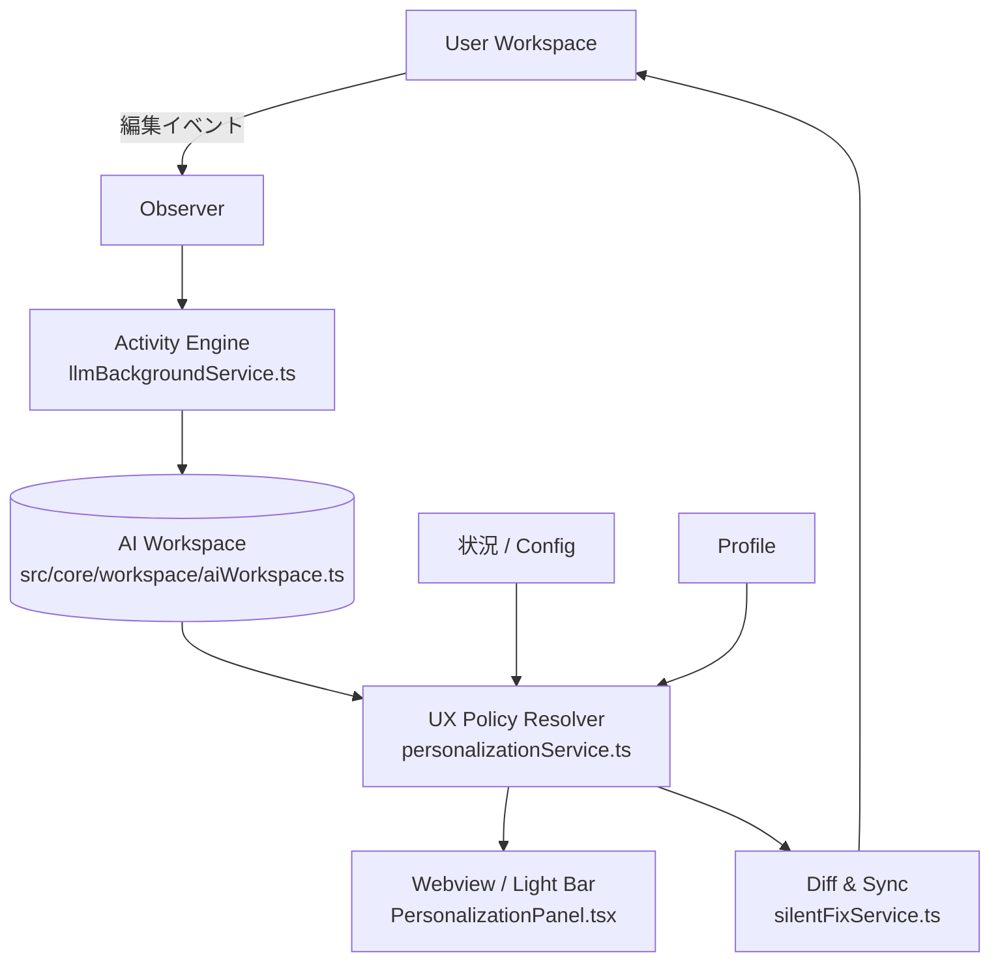

# AI生成テキスト・パーソナライズ機能＋UIUX設計思想 実装仕様書 (Execution Blueprint)

**Version:** 1.0 (Execution Ready)
**位置づけ:** 「AI生成テキスト・パーソナライズ機能＋UIUX設計思想 仕様書 v0.3」の実装仕様化・コーディングエージェント向け指示書
**スコープ:** UIUXの刷新 ＋ UIUXのパーソナライズ の完全実装

> [!WARNING]
> 旧仕様書 `uiux_detailed_specification.md` は本ドキュメントに統合され非推奨（Deprecated）となりました。以後の実装・参照は本ドキュメントのみを正とします。（必要に応じて旧ファイルは削除してください）

---

## 1. 目的と非目的

### 1.1 目的
1. AIの「活動」と「介入」を分離したUIへ刷新する。
2. 介入を単一パラメータではなく **独立した4軸** で制御できるようにする。
3. User Workspace / AI Workspace を分離し、AIがユーザーの編集を直接上書きしない。
4. UIUXの選好を **長期嗜好 ＋ 現在の状況** から決定・学習する。
5. コーディングAI（Gemini Pro等）が迷いなく実装できるよう、対象ファイル・型定義・設定の外部化方針を徹底的に細かく定義する。

### 1.2 非目的
- 生成物（説明テキスト・修正案の中身）のパーソナライズ方式の変更（既存のPersona機能は維持）。
- AIの自動化率の最大化（最終目標は「ユーザーがその時々に望む関係の実現」）。

---

## 2. 全体構成とコンポーネントマッピング



---

## 3. UIUXパーソナライズの制御軸 (4軸)

既存の3軸に加え、「活動量 (Activity)」を新たな軸として導入し、計4軸で制御します。

| 軸 | 内容 | Lv0 | Lv1 | Lv2 | Lv3 |
| --- | --- | --- | --- | --- | --- |
| **A. 活動量** (Activity) | AIが裏でどれだけ継続的に案を作るか | Off（手動のみ） | Low（保存時） | Mid（編集区切り） | High（常時） |
| **B. 提示度** (Visibility) | 案をどれだけユーザーに見せるか | Stealth | Subtle | Active | Proactive |
| **C. 説明量** (Explanation) | 理由をどれだけ詳しく見せるか | None | Minimal | Summary | Detailed |
| **D. 反映度** (Application) | 差分をどれだけ自動反映するか | Manual | Bulk | Conditional | Auto |

---

## 4. 実行指示 (Execution Blueprint)

コーディングエージェントは、以下の指示に従い順番に実装を行ってください。
アーキテクチャの推測は不要です。指定されたファイル・設計に従って粛々とコードを記述してください。

### フェーズ 1: 型定義の拡張と定数の切り出し

**1-1. `src/types/personalization.ts` の修正**
既存の `PersonalizationProfile` インターフェースを拡張し、4軸すべてを網羅させます。

```typescript
export type UxLevel = '0' | '1' | '2' | '3'; // UIバインディングの都合上string型推奨、数値でも可

export interface PersonalizationProfile {
  // 既存のプロパティ（persona等）は維持
  currentSituation: string;
  currentPersonaMode: string;
  
  // --- UIUX 4軸 ---
  activityLevel: UxLevel;       // 新規追加 (A軸)
  visibilityLevel: UxLevel;     // 既存 (B軸)
  explanationVerbosity: UxLevel;// 既存 (C軸)
  applicationAutomation: UxLevel;// 既存 (D軸)
  
  // 新規追加: 自動適用を許可するカテゴリ (D=2,3で使用)
  autoApplyCategories: string[]; 
}
```

**1-2. `src/config/uiuxDefaults.ts` の新規作成 (必須要件)**
状況補正の数値（Situation Offsets）や既存プリセットの4軸マッピングは、「後から書き換えやすく」するため、必ずこの独立したConfigファイルに定数として定義してください。コード内にハードコードしないでください。

```typescript
// src/config/uiuxDefaults.ts
import { UxLevel } from '../types/personalization';

// 状況ごとの軸の補正値
export const SITUATION_OFFSETS: Record<string, { activity: number, visibility: number, explanation: number, application: number }> = {
    'normal': { activity: 0, visibility: 0, explanation: 0, application: 0 },
    'deadline': { activity: 1, visibility: -1, explanation: -1, application: 1 },
    'learning': { activity: 0, visibility: 1, explanation: 1, application: -1 },
    'focus': { activity: 0, visibility: -1, explanation: -1, application: 0 },
};

// 既存プリセット（学習、フロー、職人）の初期4軸マッピング
export const PRESET_MAPPINGS: Record<string, { activity: UxLevel, visibility: UxLevel, explanation: UxLevel, application: UxLevel }> = {
    'learning': { activity: '1', visibility: '2', explanation: '3', application: '0' },
    'flow': { activity: '2', visibility: '1', explanation: '1', application: '2' },
    'artisan': { activity: '3', visibility: '0', explanation: '1', application: '0' },
};
```

### フェーズ 2: フロントエンド (Webview) の改修

**2-1. `webview-ui/src/components/PersonalizationPanel.tsx` の修正**
既存のVisibility, Explanation, Applicationの3つのドロップダウン（またはスライダー）に加え、**「Activity (活動量)」のUIを追加**してください。
ラベルは「A. 活動量 (Activity)」、選択肢は「0: Off, 1: Low, 2: Mid, 3: High」とします。
ReactのStateを更新し、VS Code側へメッセージを送る処理を確実に追加してください。

### フェーズ 3: メッセージングとバックエンドStateの同期

**3-1. `src/vscode-utils/WebviewMessageHandler.ts` の修正**
Webviewから送信される `PZ_SET_UIUX` などのアクションハンドラを拡張し、新しい `activityLevel` と `autoApplyCategories` を受け取って `personalizationService` に渡すように修正してください。

**3-2. `src/state/globalState.ts` のレガシー設定の廃止・移行**
現在 `GlobalState` に存在する `llmTriggerMode` (continuous | on-save) は、新しい `activityLevel` に役割を譲ります。機能が重複するため、`llmTriggerMode` への依存を `personalizationService.getProfile().activityLevel` へと書き換える準備をしてください。

### フェーズ 4: AI Workspace の新設と競合解決 (最重要)

**4-1. `src/core/workspace/aiWorkspace.ts` の新規作成**
現在、AIが直接ドキュメントを書き換えるリスクがあります。これを防ぐため、AIの提案を一時保持するクラスを作成します。

```typescript
// src/core/workspace/aiWorkspace.ts
export interface Proposal {
    id: string;
    uri: vscode.Uri;
    baseSnapshotVersion: number; // 提案作成時のドキュメントバージョン
    diff: string; // または TextEdit[]
    category: string;
    explanation: string;
}

export class AiWorkspace {
    private proposals: Map<string, Proposal[]> = new Map();

    public addProposal(uri: vscode.Uri, proposal: Proposal) { ... }
    public getProposals(uri: vscode.Uri) { ... }
    
    // 競合チェック: 現在のドキュメントバージョンと baseSnapshotVersion を比較する
    public checkConflicts(uri: vscode.Uri, currentVersion: number): Proposal[] {
        // baseSnapshotVersion が currentVersion より古く、かつ対象行が編集されている場合はStale（陳腐化）とする
        // ...
    }
}
```

### フェーズ 5: Activity と Application のエンジンの適応

**5-1. `src/core/llmBackgroundService.ts` (Activity Engine) の修正**
バックグラウンドの解析トリガーを、`GlobalState` ではなく、パーソナライズプロファイルの `activityLevel` (A軸) に連動させます。
- Level 0: 停止
- Level 1: 保存時のみ発火
- Level 2: 一定時間の入力停止（デバウンス）で発火
- Level 3: 積極的な裏側解析

生成された提案は直接反映せず、必ず `AiWorkspace.addProposal` を経由させます。

**5-2. `src/core/silentFixService.ts` (Application Engine) の修正**
自動適用のロジックを、プロファイルの `applicationAutomation` (D軸) と `autoApplyCategories` に連動させます。
適用前に必ず `AiWorkspace.checkConflicts` を呼び出し、競合がないこと（Base Snapshotが有効であること）を確認してから適用するロジックに変更してください。

---

## 5. 受け入れ基準 (Definition of Done)

1. `src/config/uiuxDefaults.ts` が存在し、状況補正値がハードコードから排除されていること。
2. Reactパネル上に「Activity」の選択肢が表示され、バックエンドのProfileまで値が同期されること。
3. `AiWorkspace` が実装され、LLMが生成した提案が一旦そこにプールされること（直接の編集破壊が行われないこと）。
4. ユーザーがファイルを編集してVersionが進んだ場合、古いVersionをベースにしたProposalの自動適用がブロックされる（競合解決）こと。

*(実装担当エージェントへ: 本仕様書を読み次第、直ちにフェーズ1からコーディングを開始してください。)*
